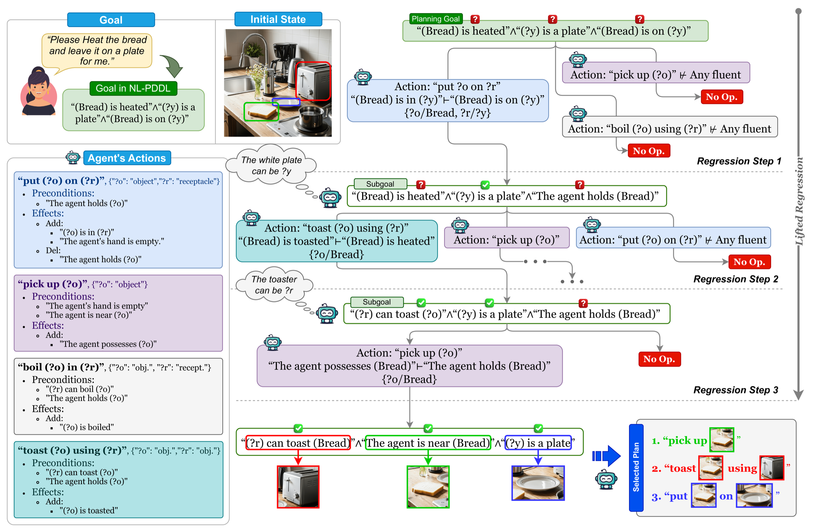

<h1 align="center">Natural Language PDDL (NL-PDDL)</h1>
<h3 align="center">Open-World Goal-Oriented Commonsense Regression Planning for Embodied AI</h3>

<p align="center">
  <a href="https://d3mlab.github.io/NL-PDDL/"></a>
  <a href="https://openreview.net/pdf?id=kWCNhRdcDI"></a>
  <a href="https://github.com/D3Mlab/NL-PDDL"></a>
  <a href="https://colab.research.google.com/drive/1GDg7mXKJ__JUgM_YAEbZYclXD2zXkMXc?usp=sharing"></a>
</p>
<p align="center">
  
</p>

This repository contains the implementation of our **ICLR 2026** paper: [Natural Language PDDL (NL-PDDL) for Open-world Goal-oriented Commonsense Regression Planning in Embodied AI](https://openreview.net/pdf?id=kWCNhRdcDI).

## Abstract
<details>
<summary> (click to expand)</summary>

Planning in open-world environments, where agents must act with partially observed states and incomplete knowledge, is a central challenge in embodied AI. Open-world planning involves not only sequencing actions but also determining what information the agent needs to sense to enable those actions. Existing approaches using Large Language Models (LLM) and Vision-Language Models (VLM) cannot reliably plan over long horizons and complex goals, where they often hallucinate and fail to reason causally over agent-environment interactions. Alternatively, classical PDDL planners offer correct and principled reasoning, but fail in open-world settings: they presuppose complete models and depend on exhaustive grounding over all objects, states, and actions; they cannot address misalignment between goal specifications (e.g., 'heat the bread') and action specifications (e.g., 'toast the bread'); and they do not generalize across modalities. To address these challenges, we contribute the following: (i) we extend symbolic PDDL into a flexible natural language representation that we term NL-PDDL, improving accessibility for non-expert users as well as generalization over modalities; (ii) we generalize regression-style planning to NL-PDDL with commonsense entailment reasoning to determine what needs to be observed for goal achievement in partially-observed environments with potential goal-action specification misalignment; and
(iii) we leverage the lifted specification of NL-PDDL to facilitate open-world reasoning that avoids exhaustive grounding and yields a time and space complexity independent of the number of ground objects, states, and actions. Our experiments in three diverse domains --- classical Blocksworld and the embodied ALFWorld environment with both textual and visual states --- show that NL-PDDL substantially outperforms existing baselines, is more robust to longer horizons and more complex goals, and generalizes across modalities.

</details>

## Quick start

Try NL-PDDL without any local setup, or follow the full interactive walkthrough:

[](https://colab.research.google.com/drive/1GDg7mXKJ__JUgM_YAEbZYclXD2zXkMXc?usp=sharing) &nbsp; 
- **[Blockworld tutorial — Colab notebook](https://colab.research.google.com/drive/1GDg7mXKJ__JUgM_YAEbZYclXD2zXkMXc?usp=sharing)** — run the end-to-end misaligned-Blockworld tutorial (clone, install, LLM entailment, plan viewer) directly in your browser with a support of local Gemma-4-E4B-it LLM (no API key needed) or your own OpenAI key (optional).
- **[HTML tutorial](https://d3mlab.github.io/NL-PDDL/tutorial.html)** — the same walkthrough rendered on the project site

### Local install

```bash
# 1) Create a dedicated Python environment (optional but recommended)
python3 -m venv nl_pddl
source nl_pddl/bin/activate
python -m pip install --upgrade pip

# 2) Clone and install
git clone https://github.com/D3Mlab/NL-PDDL.git
cd NL-PDDL
pip install -e .

# 3) LLM API key (required only for datasets with misalignment)
export OPENAI_API_KEY="your api key"
```

### Option 1: Unified runner (single script) (For Text input Dataset Only)

Run any supported dataset with one script and configurable depth/time limits using `pddl_planner/tests/run_unified.py`.

```bash
python pddl_planner/tests/run_unified.py --dataset blockworld --max_depth 12 --max_time 120 --limit 3
```

Arguments

- **--dataset**: Which dataset to run. Choices:
  - `alfworld_text`
  - `alfworld_text_with_misalignment`
  - `blockworld`
  - `misalignment_blockworld`
  - `mystery_blockworld`
  - `randomized_blockworld`

- **--max_depth**: Maximum regression depth. Higher explores more but takes longer. Default: `10`.
- **--max_time**: Per-problem time limit in seconds; `None` for no limit. Default: `None`.
- **--limit**: Number of problems from the dataset to run (starting from index 0). Default: `1`.

Outputs

- **Results**: `pddl_planner/tests/results/{result_prefix}_results_depth{max_depth}/{result_prefix}_results_{i}.txt`
- **Logs**: `pddl_planner/tests/logs/{result_prefix}_results_depth{max_depth}/{result_prefix}_results_depth{max_depth}_{i}.txt`
- **LLM cache**: Auto-created under `pddl_planner/tests/llm_cache/` (per dataset) to speed up repeated runs.

Examples

- Blockworld, 12 depth in plan, time-capped, 3 problems:
```bash
python pddl_planner/tests/run_unified.py --dataset blockworld --max_depth 12 --max_time 120 --limit 3
```

- ALFWorld text default time, 1 problem:
```bash
python pddl_planner/tests/run_unified.py --dataset alfworld_text --max_depth 10 --limit 1
```

### Option 2: Script for each dataset

```bash
# 3) Generating Regressed Plan for the Text Based Dataset or ALFWorld Text, Blockworlds, and its variants

# Closed World Task
python scripts/run_blocksworld.py # Blocksworld
python scripts/run_misalignment_blockworld.py # Misalignment Blocksworld
python pddl_planner/tests/run_mystery_blockworld.py # Mystery Blocksworld
python pddl_planner/tests/run_randomized_blockworld.py # Randomize Blocksworld

# Open World Task
python scripts/run_alfworld_text.py  # ALFWorld Text 
python scripts/run_alfworld_text_with_misalignment.py # ALFWorld Text with Misalignment
python validator/alfworld_exp/run_alfworld_VLM.py  #ALFWorld Vision without/with Misalignment with Validation (Require additional setup for the Visiual Enviorment specified in validator/alfworld_exp/README.md) 

```


---
## Table of Contents

This repo contain the Python implementation of NL-PDDL integrates **First-Order Logic (FOL) regression** with **NL Description** of action and provides an **LLM-based commonsense entailment** interface to reconcile **model–goal misalignment** in real datasets.

- [What it does](#what-it-does)
- [Directory Structure](#directory-structure)
- [Quick start](#quick-start)
- [BlockWorld Validation Suite](#block-test-validation-suite)
- [Configurable NL-PDDL Runner](#configurable-nl-pddl-runner)
- [Structure of NL Description of the Action Model and Goal Files](#structure-of-nl-domain-and-goal-files)
## What it does
- **NL parsing to logic.** Parses natural-language descriptions of **action models** and **goals** into **predicates** and **logic formulae** (with types).
- **FOL regression planning (open-world).** Implements NL-PDDL **regression planners** under FOL with a built-in framework for **unification, substitution,** and **formula manipulation** tailored to **open-world** settings.
- **LLM commonsense entailment.** Uses an LLM API for **type checking** and **predicate entailment** to unify **misaligned goal predicates** with action-model predicates (handling naming drift and abstraction gaps).
- Dataset support for both **open-world** (e.g., ALFWorld Vision/Text with misalignments) and **closed-world** (e.g., Blocksworld variants) planning tasks  

### Supported tasks
Scripts are provided to run NL-PDDL on:
- **ALFWorld (Vision)**
- **ALFWorld (Text)**
- **Blocksworld** (including challenging variants with naming “mystery/randomized” and newly introduced varient "Misalignment Blockworld")
- Customizable NL description of action models and goal

### Key features
- NL → Logic conversion with typed predicates and SSA support  
- FOL regression planner for open-world goals (soundness by construction under the given SSA/model)  
- LLM-assisted entailment for robust goal–model alignment  
- Modular design for plugging in alternative unification and similarity measures

## Directory Structure

```
pddl_solver/
├── pddl_planner/
│   ├── logic/
│   │   ├── parser.py       # PDDL → logic parser
│   │   ├── nl_parser.py    # NL → logic parser
│   │   ├── formula.py      # Formula classes (Conjunctive, Disjunctive, Predicate, Equality)
│   │   ├── nl_formula.py   # Formula classes with NL representation and NL-aware logic ops
│   │   └── operation.py    # Unification & standardization operations
│   │
│   ├── pddl_core/
│   │   ├── domain.py       # PDDL domain parser (types, predicates, actions)
│   │   ├── nl_domain.py    # NL domain parser
│   │   ├── instance.py     # PDDL problem parser (initial state, goal, objects)
│   │   └── nl_instance.py  # NL problem parser (initial state, goal, objects)
│   │
│   ├── planner/
│   │   └── nl_planner.py   # NL FOLRegressionPlanner
│   │
│   ├── llm/
│   │   ├── llm.py          # Entailment via cache + LLM
│   │   └── llm_with_type.py# Entailment with type checking
│   │
│   ├── test/                                       # Test Script for Completed Datasets
│   │   ├── run_unified.py                          # Unified Runner across all datasets
│   │   ├── run_blockworld.py                       # Blockworld dataset
│   │   ├── run_alfworld_text.py                    # ALFWorld Text dataset
│   │   ├── run_randomized_blockworld.py            # ALFWorld Text dataset
│   │   ├── run_mystery_blockworld.py               # ALFWorld Text dataset
│   │   ├── run_alfworld_text_with_misalignment.py  # ALFWorld Text w/ misalignment
│   │   ├── run_blockworld.py                       # Blockworld dataset
│   │   └── run_misalignment_blockworld.py          # Misalignment Blockworld dataset
│   │
│   ├── scripts/
│   │   └── run_nl_pddl.py              # Configurable NL-PDDL Runner
│
├── file/                               # Datasets in JSON-format
│   ├── alfworld_text_with_misalignment/
│   │   ├── alfworld_text_model.json
│   │   └── alfworld_text_goal.json
│
│   ├── alfworld_text_with_misalignment/
│   │   ├── alfworld_text_with_misalignment_model.json
│   │   └── alfworld_text_with_misalignment_goal.json
│   │
│   ├── blockworld/
│   │   ├── blockworld_model.json
│   │   └── blockworld_goal.json
│   │
│   ├── randomized_blockworld/
│   │   ├── model.json
│   │   └── goal.json
│   │
│   ├── mystery_blockworld/
│   │   ├── model.json
│   │   └── goal.json
│   │
│   └── misalignment_blockworld/
│       ├── misalignment_blockworld_model.json
│       └── blockworld_goal.json  # Same goal but misaligned actions
│
├── validator/                    # Additional support codes for validation of Regressed Plan in Blockworld and ALFworld
│   ├── alfworld_exp              # Validation for alfworld Text / Plan Generation and Validation for ALFWorld Vision
│       ├── run_alfworld_NL.py    # ALFWorld Text
│       └── run_alfworld_VLM.py   # ALFWorld Vision
│   ├── block_test_repo           # Validator for Blockworlds
│
└── README.md                     # This file
```

## Blockworld Validation Suite (Required a Linux System)

The `validator/block_test_repo` directory contains a suite of Python scripts designed to validate subgoals and plans generated by the NL-PDDL planner for BlockWorld Datasets. It provides tools to check for the satisfiability of subgoals in the initial state, validate plan using the VAL tool, and summarize the results. Below we provide detail description on validation for different input and tasks.

### Key Scripts
`run_blockworld_validator.py`

This script processes a folder of regressed plans generated by the NL-PDDL testing scripts for different tasks (e.g., ALFWorld Text and Blocksworld). It automatically iterates through all regressed plans and validates each plan for both soundness and completeness.

**Usage:**

```bash
  python run_blockworld_validator.py \
      --input-dir block_world_test/planbench/blockworld_results_depth10 \
      --output-dir block_world_test/planbench/blockworld_results_depth10_validation \
      --goal-mode first_subgoal \
      --val ./val/bin/Validate
```
 -  `--input-dir` should contains the folder of Regressed Plan generated from either `python scripts/run_blocksworld.py ` or its variant for Msythery, Randomized or Misalignment Blockworlds.
 - `--output-dir` should be the folder path for generated validation results to stores
 - `--val` contains the PDDL validator package in `block_test_repo/val` 

For more detail, please refer to the description in the `block_test_repo` subpackage `validator/block_test_repo/README.md`

## Configurable NL-PDDL Runner

Use `pddl_planner/scripts/run_nl_pddl.py` to run the NL-PDDL FOL regression planner with fully customizable inputs and outputs.

Purpose

- Run `NLFOLRegressionPlanner` over arbitrary NL JSON models and goals
- Control depth/time and I/O locations; optionally pass an LLM key/model and cache

Arguments

- `--model` (str): Path to NL model JSON. Default: `files/blockworld/blockworld_model.json`, please refer to below section on the required structrure of the JSON
- `--goals` (str): Path to NL goals JSON. Default: `files/blockworld/blockworld_goal.json`, please refer to below section on the required structrure of the JSON
- `--max_depth` (int): Maximum regression depth. Default: `10`
- `--time_limit` (int): Time limit per problem in seconds. Default: `None` (no limit)
- `--llm_model` (str): LLM model name. Default: `gpt-4o-mini`
- `--llm_api_key` (str): LLM API key (overrides env `OPENAI_API_KEY` if provided). Default: `None`
- `--cache_path` (str): Path to LLM cache JSON; auto-created if missing. Default: derived from model path
- `--output_dir` (str): Directory to write results files. Default: derived from model path and depth
- `--log_dir` (str): Directory to write log files. Default: derived from model path and depth
- `--limit` (int): Number of problems to run (from index 0). Default: `1`

Examples

```bash
# Default Blockworld
python pddl_planner/scripts/run_nl_pddl.py

# Custom model/goals, depth, time, output, log, cache, and multiple problems
python pddl_planner/scripts/run_nl_pddl.py \
  --model files/misalignment_blockworld/misalignment_blockworld_model.json \
  --goals files/blockworld/blockworld_goal.json \
  --max_depth 12 \
  --time_limit 120 \
  --output_dir outputs/misalignment_depth12 \
  --log_dir logs/misalignment_depth12 \
  --cache_path pddl_planner/tests/llm_cache/misalignment_blockworld.json \
  --limit 3

# ALFWorld Text 
python pddl_planner/scripts/run_nl_pddl.py \
  --model files/alfworld_text/alfworld_text_model.json \
  --goals files/alfworld_text/alfworld_text_goal.json \
  --max_depth 8 \
  --output_dir outputs/alfworld_text_d8 \
  --log_dir logs/alfworld_text_d8
```

## Structure of NL Domain and Goal Files

We currently support a fixed JSON format for NL domain and goal files. See examples in `files/alfworldtext_domain.json` and `files/alfworldtext_goal.json`.

---

### Domain File (*_domain.json)

The domain file is a JSON array:
	1.	First element: Predicates
	2.	Subsequent elements: Actions

Predicates block
```json
{
  "Predicate": [
    ["the agent's hand is empty", {}],
    ["the agent is holding ?o", {"?o": "object"}],
    ["?o is in ?r", {"?o": "object", "?r": "object"}]
  ]
}
```

Action block
```json
{
  "Action": "PutIn",
  "Action name": ["put ?o into ?r", {"?o": "object", "?r": "object"}],
  "Parameters": {"?o": "object", "?r": "object"},
  "Preconditions": [
    ["the agent is holding ?o", {"?o": "object"}]
  ],
  "Effects": {
    "Positive": [
      ["?o is in ?r", {"?o": "object", "?r": "object"}],
      ["the agent's hand is empty", {}]
    ],
    "Negative": [
      ["the agent is holding ?o", {"?o": "object"}]
    ]
  }
}
```

---

### Goal File (*_goal.json)

The goal file is a JSON array of goal sets.
Each goal set is a list of predicate instances that must hold at the end.
```json
[
  [
    ["the agent's hand is empty", {}],
    ["goal_obj is a tomato", {"goal_obj": "object"}],
    ["goal_recep is a fridge", {"goal_recep": "object"}],
    ["goal_obj is inside goal_recep", {"goal_obj": "object", "goal_recep": "object"}]
  ]
]
```
For closed-world domains where the initial state is fully known, it is optional to also specify the initial states in the goal file for each task. For example, in Blocksworld, the initial state may be included in the same format before the goal conditions.
```json
[
  [
    # initial state
    [
      [
        "red is clear",
        {
          "red": "object"
        }
      ],
      [
        "yellow is clear",
        {
          "yellow": "object"
        }
      ]
    ],
    # goal
    [
      [
        "orange is on top of red",
        {
          "orange": "object",
          "red": "object"
        }
      ]
    ]
  ]
]
```
---

### Conventions

	•	Variables start with ? (e.g., `?o`, `?r`).
	•	Types are strings (e.g., "`object").
	•	Exact string match is required across predicates, actions, and goals.
	•	Effects are split into "Positive" (add) and "Negative" (delete).

---

## Citation

If you find our work useful, please consider giving a 🌟 to our repo and citing our paper.

```text
@inproceedings{
liu2026natural,
title={Natural Language {PDDL} ({NL}-{PDDL}) for Open-world Goal-oriented Commonsense Regression Planning in Embodied {AI}},
author={Xiaotian Liu and Armin Toroghi and Jiazhou Liang and David Courtis and Ruiwen Li and Ali Pesaranghader and Jaehong Kim and Tanmana Sadhu and Hyejeong Jeon and Scott Sanner},
booktitle={The Fourteenth International Conference on Learning Representations},
year={2026},
url={https://openreview.net/forum?id=kWCNhRdcDI}
}
```
